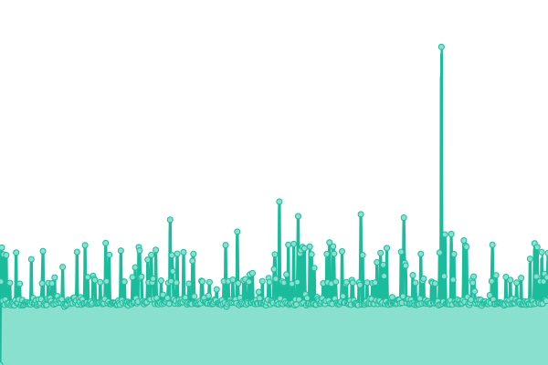
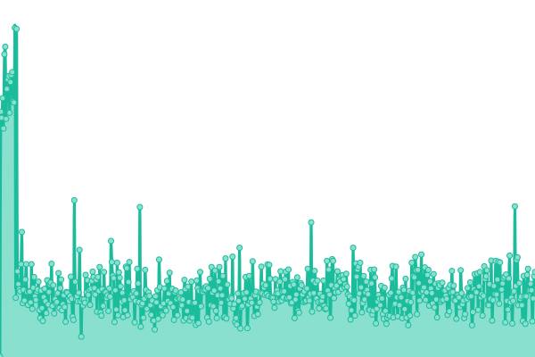

# [📈 Live Status](https://status.tigefa.com): <!--live status--> **🟩 All systems operational**

This repository contains the open-source uptime monitor and status page for [Sugeng Tigefa](https://tigefa.my.id), powered by [Upptime](https://github.com/upptime/upptime).

With [Upptime](https://upptime.js.org), you can get your own unlimited and free uptime monitor and status page, powered entirely by a GitHub repository. We use [Issues](https://github.com/tigefa4u/status/issues) as incident reports, [Actions](https://github.com/tigefa4u/status/actions) as uptime monitors, and [Pages](https://status.tigefa.com) for the status page.

<!--start: status pages-->
<!-- This summary is generated by Upptime (https://github.com/upptime/upptime) -->
<!-- Do not edit this manually, your changes will be overwritten -->
<!-- prettier-ignore -->
| URL | Status | History | Response Time | Uptime |
| --- | ------ | ------- | ------------- | ------ |
|  [Tigefa](https://tigefa.com) | 🟩 Up | [tigefa.yml](https://github.com/tigefa4u/status/commits/HEAD/history/tigefa.yml) | 

 1311ms
     
 | 

<a href="https://status.tigefa.com/history/tigefa">100.00%</a>
    

|  [Tigefa Neet](https://tigefa.net) | 🟩 Up | [tigefa-neet.yml](https://github.com/tigefa4u/status/commits/HEAD/history/tigefa-neet.yml) | 

 1997ms
     
 | 

<a href="https://status.tigefa.com/history/tigefa-neet">100.00%</a>
    

|  [Minio](https://tigefa.site) | 🟩 Up | [minio.yml](https://github.com/tigefa4u/status/commits/HEAD/history/minio.yml) | 

 529ms
     
 | 

<a href="https://status.tigefa.com/history/minio">100.00%</a>
    

|  [Tigefa.win](https://tigefa.win) | 🟩 Up | [tigefa-win.yml](https://github.com/tigefa4u/status/commits/HEAD/history/tigefa-win.yml) | 

 162ms
     
 | 

<a href="https://status.tigefa.com/history/tigefa-win">100.00%</a>
    

|  [Tigefa.pw](https://tigefa.pw) | 🟩 Up | [tigefa-pw.yml](https://github.com/tigefa4u/status/commits/HEAD/history/tigefa-pw.yml) | 

 863ms
     
 | 

<a href="https://status.tigefa.com/history/tigefa-pw">100.00%</a>
    

|  [Tigefa blog](https://tigefa.my.id) | 🟩 Up | [tigefa-blog.yml](https://github.com/tigefa4u/status/commits/HEAD/history/tigefa-blog.yml) | 

 772ms
     
 | 

<a href="https://status.tigefa.com/history/tigefa-blog">100.00%</a>
    

|  [Plausible](https://plausible.my.id) | 🟩 Up | [plausible.yml](https://github.com/tigefa4u/status/commits/HEAD/history/plausible.yml) | 

 1218ms
     
 | 

<a href="https://status.tigefa.com/history/plausible">100.00%</a>
    

|  [PrivateBin](https://privatebin.my.id) | 🟩 Up | [private-bin.yml](https://github.com/tigefa4u/status/commits/HEAD/history/private-bin.yml) | 

 1177ms
     
 | 

<a href="https://status.tigefa.com/history/private-bin">100.00%</a>
    

|  [Yourls](https://urls.my.id) | 🟩 Up | [yourls.yml](https://github.com/tigefa4u/status/commits/HEAD/history/yourls.yml) | 

 772ms
     
 | 

<a href="https://status.tigefa.com/history/yourls">100.00%</a>
    

|  [cURLs.top](https://curls.top) | 🟩 Up | [c-ur-ls-top.yml](https://github.com/tigefa4u/status/commits/HEAD/history/c-ur-ls-top.yml) | 

 397ms
     
 | 

<a href="https://status.tigefa.com/history/c-ur-ls-top">100.00%</a>
    

|  [Kodev](https://kodev.my.id) | 🟩 Up | [kodev.yml](https://github.com/tigefa4u/status/commits/HEAD/history/kodev.yml) | 

 1834ms
     
 | 

<a href="https://status.tigefa.com/history/kodev">100.00%</a>
    

<!--end: status pages-->

[**Visit our status website →**](https://status.tigefa.com)

## 📄 License

- Powered by: [Upptime](https://github.com/upptime/upptime)
- Code: [MIT](./LICENSE) © [Sugeng Tigefa](https://tigefa.my.id)
- Data in the `./history` directory: [Open Database License](https://opendatacommons.org/licenses/odbl/1-0/)
