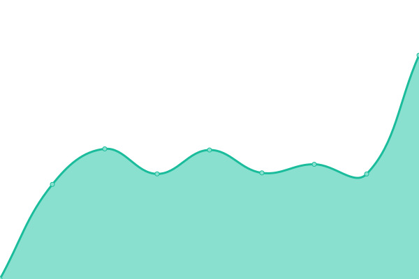

# [📈 Live Status](https://status.tigefa.com): <!--live status--> **🟧 Partial outage**

This repository contains the open-source uptime monitor and status page for [Sugeng Tigefa](https://tigefa.my.id), powered by [Upptime](https://github.com/upptime/upptime).

With [Upptime](https://upptime.js.org), you can get your own unlimited and free uptime monitor and status page, powered entirely by a GitHub repository. We use [Issues](https://github.com/tigefa4u/status/issues) as incident reports, [Actions](https://github.com/tigefa4u/status/actions) as uptime monitors, and [Pages](https://status.tigefa.com) for the status page.

<!--start: status pages-->
<!-- This summary is generated by Upptime (https://github.com/upptime/upptime) -->
<!-- Do not edit this manually, your changes will be overwritten -->
<!-- prettier-ignore -->
| URL | Status | History | Response Time | Uptime |
| --- | ------ | ------- | ------------- | ------ |
|  [Tigefa.com](https://tigefa.com) | 🟩 Up | [tigefa-com.yml](https://github.com/tigefa4u/status/commits/HEAD/history/tigefa-com.yml) | 

 1268ms
     
 | 

<a href="https://status.tigefa.com/history/tigefa-com">100.00%</a>
    

|  [Tigefa.net](https://tigefa.net) | 🟩 Up | [tigefa-net.yml](https://github.com/tigefa4u/status/commits/HEAD/history/tigefa-net.yml) | 

 1689ms
     
 | 

<a href="https://status.tigefa.com/history/tigefa-net">100.00%</a>
    

|  [Tigefa.site](https://tigefa.site) | 🟩 Up | [tigefa-site.yml](https://github.com/tigefa4u/status/commits/HEAD/history/tigefa-site.yml) | 

 627ms
     
 | 

<a href="https://status.tigefa.com/history/tigefa-site">99.49%</a>
    

|  [Tigefa.win](https://tigefa.win) | 🟩 Up | [tigefa-win.yml](https://github.com/tigefa4u/status/commits/HEAD/history/tigefa-win.yml) | 

 193ms
     
 | 

<a href="https://status.tigefa.com/history/tigefa-win">100.00%</a>
    

|  [Tigefa.pw](https://tigefa.pw) | 🟩 Up | [tigefa-pw.yml](https://github.com/tigefa4u/status/commits/HEAD/history/tigefa-pw.yml) | 

 981ms
     
 | 

<a href="https://status.tigefa.com/history/tigefa-pw">100.00%</a>
    

|  [Tigefa.info](https://www.tigefa.info) | 🟩 Up | [tigefa-info.yml](https://github.com/tigefa4u/status/commits/HEAD/history/tigefa-info.yml) | 

 305ms
     
 | 

<a href="https://status.tigefa.com/history/tigefa-info">100.00%</a>
    

|  [Tigefa.co](https://tigefa.co) | 🟩 Up | [tigefa-co.yml](https://github.com/tigefa4u/status/commits/HEAD/history/tigefa-co.yml) | 

 117ms
     
 | 

<a href="https://status.tigefa.com/history/tigefa-co">99.85%</a>
    

|  [Tigefa.live](https://tigefa.live) | 🟩 Up | [tigefa-live.yml](https://github.com/tigefa4u/status/commits/HEAD/history/tigefa-live.yml) | 

 456ms
     
 | 

<a href="https://status.tigefa.com/history/tigefa-live">99.85%</a>
    

|  [Tigefa.my.id](https://tigefa.my.id) | 🟩 Up | [tigefa-my-id.yml](https://github.com/tigefa4u/status/commits/HEAD/history/tigefa-my-id.yml) | 

 192ms
     
 | 

<a href="https://status.tigefa.com/history/tigefa-my-id">99.85%</a>
    

|  [Tigefa.xyz](https://tigefa.xyz) | 🟥 Down | [tigefa-xyz.yml](https://github.com/tigefa4u/status/commits/HEAD/history/tigefa-xyz.yml) | 

 899ms
     
 | 

<a href="https://status.tigefa.com/history/tigefa-xyz">99.00%</a>
    

|  [sugeng.win](https://sugeng.win) | 🟩 Up | [sugeng-win.yml](https://github.com/tigefa4u/status/commits/HEAD/history/sugeng-win.yml) | 

 561ms
     
 | 

<a href="https://status.tigefa.com/history/sugeng-win">99.85%</a>
    

|  [Plausible.my.id](https://plausible.my.id) | 🟩 Up | [plausible-my-id.yml](https://github.com/tigefa4u/status/commits/HEAD/history/plausible-my-id.yml) | 

 932ms
     
 | 

<a href="https://status.tigefa.com/history/plausible-my-id">99.61%</a>
    

|  [Commento.my.id](https://commento.my.id) | 🟩 Up | [commento-my-id.yml](https://github.com/tigefa4u/status/commits/HEAD/history/commento-my-id.yml) | 

 1067ms
     
 | 

<a href="https://status.tigefa.com/history/commento-my-id">99.61%</a>
    

|  [PrivateBin.my.id](https://privatebin.my.id) | 🟩 Up | [private-bin-my-id.yml](https://github.com/tigefa4u/status/commits/HEAD/history/private-bin-my-id.yml) | 

 935ms
     
 | 

<a href="https://status.tigefa.com/history/private-bin-my-id">99.62%</a>
    

|  [Urls.my.id](https://urls.my.id) | 🟩 Up | [urls-my-id.yml](https://github.com/tigefa4u/status/commits/HEAD/history/urls-my-id.yml) | 

 222ms
     
 | 

<a href="https://status.tigefa.com/history/urls-my-id">99.85%</a>
    

|  [tgfa.my.id](https://tgfa.my.id) | 🟩 Up | [tgfa-my-id.yml](https://github.com/tigefa4u/status/commits/HEAD/history/tgfa-my-id.yml) | 

 200ms
     
 | 

<a href="https://status.tigefa.com/history/tgfa-my-id">99.85%</a>
    

|  [cURLs.top](https://curls.top) | 🟩 Up | [c-ur-ls-top.yml](https://github.com/tigefa4u/status/commits/HEAD/history/c-ur-ls-top.yml) | 

 661ms
     
 | 

<a href="https://status.tigefa.com/history/c-ur-ls-top">99.85%</a>
    

|  [cekip.my.id](https://cekip.my.id) | 🟩 Up | [cekip-my-id.yml](https://github.com/tigefa4u/status/commits/HEAD/history/cekip-my-id.yml) | 

 141ms
     
 | 

<a href="https://status.tigefa.com/history/cekip-my-id">100.00%</a>
    

|  [Kodev.my.id](https://kodev.my.id) | 🟩 Up | [kodev-my-id.yml](https://github.com/tigefa4u/status/commits/HEAD/history/kodev-my-id.yml) | 

 950ms
     
 | 

<a href="https://status.tigefa.com/history/kodev-my-id">99.85%</a>
    

<!--end: status pages-->

[**Visit our status website →**](https://status.tigefa.com)

## 📄 License

- Powered by: [Upptime](https://github.com/upptime/upptime)
- Code: [MIT](./LICENSE) © [Sugeng Tigefa](https://tigefa.my.id)
- Data in the `./history` directory: [Open Database License](https://opendatacommons.org/licenses/odbl/1-0/)
