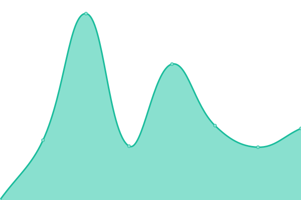

# [📈 Live Status](https://status.tigefa.com): <!--live status--> **🟩 All systems operational**

This repository contains the open-source uptime monitor and status page for [Sugeng Tigefa](https://tigefa.my.id), powered by [Upptime](https://github.com/upptime/upptime).

With [Upptime](https://upptime.js.org), you can get your own unlimited and free uptime monitor and status page, powered entirely by a GitHub repository. We use [Issues](https://github.com/tigefa4u/status/issues) as incident reports, [Actions](https://github.com/tigefa4u/status/actions) as uptime monitors, and [Pages](https://status.tigefa.com) for the status page.

<!--start: status pages-->
<!-- This summary is generated by Upptime (https://github.com/upptime/upptime) -->
<!-- Do not edit this manually, your changes will be overwritten -->
<!-- prettier-ignore -->
| URL | Status | History | Response Time | Uptime |
| --- | ------ | ------- | ------------- | ------ |
|  [Tigefa.com](https://tigefa.com) | 🟩 Up | [tigefa-com.yml](https://github.com/tigefa4u/status/commits/HEAD/history/tigefa-com.yml) | 

 202ms
     
 | 

<a href="https://status.tigefa.com/history/tigefa-com">100.00%</a>
    

|  [Tigefa.net](https://tigefa.net) | 🟩 Up | [tigefa-net.yml](https://github.com/tigefa4u/status/commits/HEAD/history/tigefa-net.yml) | 

 246ms
     
 | 

<a href="https://status.tigefa.com/history/tigefa-net">100.00%</a>
    

|  [Tigefa.win](https://tigefa.win) | 🟩 Up | [tigefa-win.yml](https://github.com/tigefa4u/status/commits/HEAD/history/tigefa-win.yml) | 

 149ms
     
 | 

<a href="https://status.tigefa.com/history/tigefa-win">100.00%</a>
    

|  [Tigefa.pw](https://tigefa.pw) | 🟩 Up | [tigefa-pw.yml](https://github.com/tigefa4u/status/commits/HEAD/history/tigefa-pw.yml) | 

 807ms
     
 | 

<a href="https://status.tigefa.com/history/tigefa-pw">100.00%</a>
    

|  [Tigefa.info](https://www.tigefa.info) | 🟩 Up | [tigefa-info.yml](https://github.com/tigefa4u/status/commits/HEAD/history/tigefa-info.yml) | 

 340ms
     
 | 

<a href="https://status.tigefa.com/history/tigefa-info">100.00%</a>
    

|  [Tigefa.co](https://tigefa.co) | 🟩 Up | [tigefa-co.yml](https://github.com/tigefa4u/status/commits/HEAD/history/tigefa-co.yml) | 

 160ms
     
 | 

<a href="https://status.tigefa.com/history/tigefa-co">100.00%</a>
    

|  [Tigefa.live](https://tigefa.live) | 🟩 Up | [tigefa-live.yml](https://github.com/tigefa4u/status/commits/HEAD/history/tigefa-live.yml) | 

 481ms
     
 | 

<a href="https://status.tigefa.com/history/tigefa-live">100.00%</a>
    

|  [Tigefa.my.id](https://tigefa.my.id) | 🟩 Up | [tigefa-my-id.yml](https://github.com/tigefa4u/status/commits/HEAD/history/tigefa-my-id.yml) | 

 189ms
     
 | 

<a href="https://status.tigefa.com/history/tigefa-my-id">100.00%</a>
    

|  [Tigefa.xyz](https://tigefa.xyz) | 🟩 Up | [tigefa-xyz.yml](https://github.com/tigefa4u/status/commits/HEAD/history/tigefa-xyz.yml) | 

 617ms
     
 | 

<a href="https://status.tigefa.com/history/tigefa-xyz">100.00%</a>
    

|  [Tigefa.web.id](https://tigefa.web.id) | 🟩 Up | [tigefa-web-id.yml](https://github.com/tigefa4u/status/commits/HEAD/history/tigefa-web-id.yml) | 

 206ms
     
 | 

<a href="https://status.tigefa.com/history/tigefa-web-id">100.00%</a>
    

|  [Tigefa.icu](https://tigefa.icu) | 🟩 Up | [tigefa-icu.yml](https://github.com/tigefa4u/status/commits/HEAD/history/tigefa-icu.yml) | 

 719ms
     
 | 

<a href="https://status.tigefa.com/history/tigefa-icu">100.00%</a>
    

|  [sugeng.win](https://sugeng.win) | 🟩 Up | [sugeng-win.yml](https://github.com/tigefa4u/status/commits/HEAD/history/sugeng-win.yml) | 

 242ms
     
 | 

<a href="https://status.tigefa.com/history/sugeng-win">100.00%</a>
    

|  [tgfa.my.id](https://tgfa.my.id) | 🟩 Up | [tgfa-my-id.yml](https://github.com/tigefa4u/status/commits/HEAD/history/tgfa-my-id.yml) | 

 248ms
     
 | 

<a href="https://status.tigefa.com/history/tgfa-my-id">100.00%</a>
    

|  [cURLs.top](https://curls.top) | 🟩 Up | [c-ur-ls-top.yml](https://github.com/tigefa4u/status/commits/HEAD/history/c-ur-ls-top.yml) | 

 369ms
     
 | 

<a href="https://status.tigefa.com/history/c-ur-ls-top">100.00%</a>
    

|  [cekip.my.id](https://cekip.my.id) | 🟩 Up | [cekip-my-id.yml](https://github.com/tigefa4u/status/commits/HEAD/history/cekip-my-id.yml) | 

 192ms
     
 | 

<a href="https://status.tigefa.com/history/cekip-my-id">100.00%</a>
    

|  [loog.my.id](https://loog.my.id) | 🟩 Up | [loog-my-id.yml](https://github.com/tigefa4u/status/commits/HEAD/history/loog-my-id.yml) | 

 754ms
     
 | 

<a href="https://status.tigefa.com/history/loog-my-id">100.00%</a>
    

|  [Kodev.my.id](https://kodev.my.id) | 🟩 Up | [kodev-my-id.yml](https://github.com/tigefa4u/status/commits/HEAD/history/kodev-my-id.yml) | 

 1700ms
     
 | 

<a href="https://status.tigefa.com/history/kodev-my-id">99.40%</a>
    

<!--end: status pages-->

[**Visit our status website →**](https://status.tigefa.com)

## 📄 License

- Powered by: [Upptime](https://github.com/upptime/upptime)
- Code: [MIT](./LICENSE) © [Sugeng Tigefa](https://tigefa.my.id)
- Data in the `./history` directory: [Open Database License](https://opendatacommons.org/licenses/odbl/1-0/)
