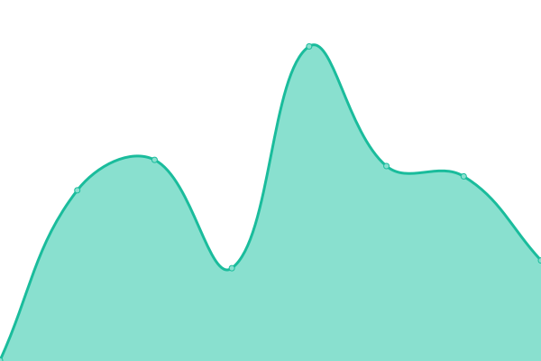

# [📈 Live Status](https://status.tigefa.web.id): <!--live status--> **🟩 All systems operational**

This repository contains the open-source uptime monitor and status page for [Sugeng Tigefa](https://tigefa.web.id), powered by [Upptime](https://github.com/upptime/upptime).

With [Upptime](https://upptime.js.org), you can get your own unlimited and free uptime monitor and status page, powered entirely by a GitHub repository. We use [Issues](https://github.com/tigefa4u/status/issues) as incident reports, [Actions](https://github.com/tigefa4u/status/actions) as uptime monitors, and [Pages](https://status.tigefa.web.id) for the status page.

<!--start: status pages-->
<!-- This summary is generated by Upptime (https://github.com/upptime/upptime) -->
<!-- Do not edit this manually, your changes will be overwritten -->
<!-- prettier-ignore -->
| URL | Status | History | Response Time | Uptime |
| --- | ------ | ------- | ------------- | ------ |
|  [Tigefa.my.id](https://tigefa.my.id) | 🟩 Up | [tigefa-my-id.yml](https://github.com/tigefa4u/status/commits/HEAD/history/tigefa-my-id.yml) | 

 286ms
     
 | 

<a href="https://status.tigefa.web.id/history/tigefa-my-id">100.00%</a>
    

|  [Tigefa.web.id](https://tigefa.web.id) | 🟩 Up | [tigefa-web-id.yml](https://github.com/tigefa4u/status/commits/HEAD/history/tigefa-web-id.yml) | 

 266ms
     
 | 

<a href="https://status.tigefa.web.id/history/tigefa-web-id">100.00%</a>
    

|  [cekip.my.id](https://cekip.my.id) | 🟩 Up | [cekip-my-id.yml](https://github.com/tigefa4u/status/commits/HEAD/history/cekip-my-id.yml) | 

 211ms
     
 | 

<a href="https://status.tigefa.web.id/history/cekip-my-id">100.00%</a>
    

|  [Tigefa.dev](https://tigefa.dev) | 🟩 Up | [tigefa-dev.yml](https://github.com/tigefa4u/status/commits/HEAD/history/tigefa-dev.yml) | 

 181ms
     
 | 

<a href="https://status.tigefa.web.id/history/tigefa-dev">100.00%</a>
    

|  [Tigefa.download](https://tigefa.download) | 🟩 Up | [tigefa-download.yml](https://github.com/tigefa4u/status/commits/HEAD/history/tigefa-download.yml) | 

 311ms
     
 | 

<a href="https://status.tigefa.web.id/history/tigefa-download">100.00%</a>
    

|  [Suge.ng](https://suge.ng) | 🟩 Up | [suge-ng.yml](https://github.com/tigefa4u/status/commits/HEAD/history/suge-ng.yml) | 

 441ms
     
 | 

<a href="https://status.tigefa.web.id/history/suge-ng">100.00%</a>
    

<!--end: status pages-->

[**Visit our status website →**](https://status.tigefa.web.id)

## 📄 License

- Powered by: [Upptime](https://github.com/upptime/upptime)
- Code: [MIT](./LICENSE) © [Sugeng Tigefa](https://tigefa.web.id)
- Data in the `./history` directory: [Open Database License](https://opendatacommons.org/licenses/odbl/1-0/)
